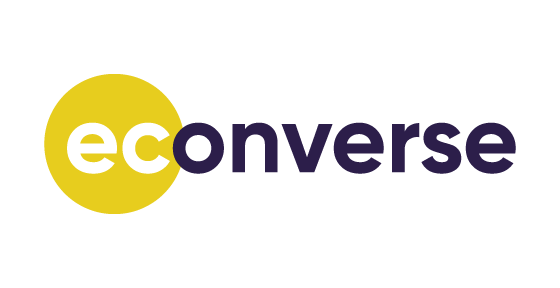
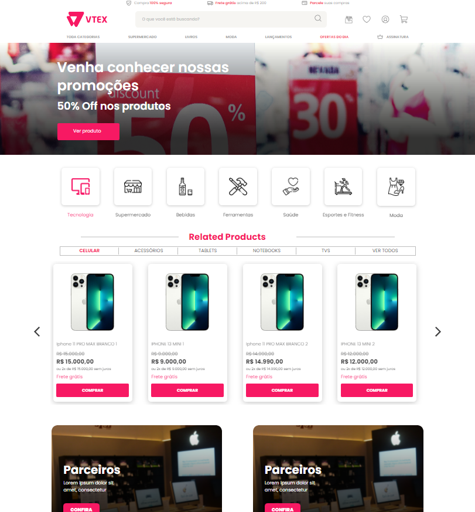

<h1 align="center">

</h1>

<h3 align="center">
  Criando um layout html pré estabelecido utilizando ReactJS/Typescript
</h3>

<p align="center">
  <a href="https://www.linkedin.com/in/rnatu/">
    
  </a>
</p>

<p align="center">
Desenvolvi um layout html pré estabelecido no figma, utilizando ReactJS e TypeScript como base.
</p>

<p align="center">
  <a href="#-sobre-o-projeto">Sobre o projeto</a>&nbsp;&nbsp;&nbsp;|&nbsp;&nbsp;&nbsp;
  <a href="#-tecnologias-utilizadas">Tecnologias utilizadas</a>&nbsp;&nbsp;&nbsp;|&nbsp;&nbsp;&nbsp;
  <a href="#-Como-utilizar">Como utilizar</a>
</p>

<h3 align="center">
  Acesse a aplicação pelo link abaixo<br />
   <font size="4">
   <a  href="https://rococo-alfajores-73bb5e.netlify.app">
  https://rococo-alfajores-73bb5e.netlify.app
  </a>
  </font>
</h3>

## 📜 Sobre o projeto

O principal objetivo desta aplicação é emular um layout de uma loja online, utilizando como referencia o projeto no figma, buscando deixar o layout mais próximo possível.

<p align="center">
  
</p>

#### Conceitos

- Layout pixel a pixel
- Propriedades
- Componentização

## 🚀 Tecnologias utilizadas

- [ReactJS](https://pt-br.reactjs.org/)
  - [sass](https://sass-lang.com/)
  - [swiper](https://swiperjs.com/)
- [Vite](https://vitejs.dev/)

Code formatter:

- [esLint](https://eslint.org/)

## ⚡ Como utilizar

### Instalando Dependências

```bash
    # Instalar as dependências
    $ npm i
```

### Iniciando aplicação

```bash
    # Iniciando aplicação
    $ npm run dev

    # A aplicação será aberta na porta:5173 - Basta acessar: http://http://localhost:5173
```

<h4 align="center">
    Made with 💜 by Renato Xavier
</h4>
